# Sean's Portfolio

### Keyword Checker

오버추어 키워드 광고 API를 이용한 키워드 검색 광고 메니징 툴

- 소속 : (주) 에코마케팅
- 사용기술 : Objective-C, ASP, MSSQL
- 프로젝트 인원 : 기획 및 개발 1명, 디자인 1명
- AppStore (https://itunes.apple.com/kr/app/id363704299)

### 제 15회 부산 국제 영화제

(공식) 제 15회 부산 국제 영화제 어플리케이션
상영 영화 리스트 및 실시간 예약 기능 제공

- 소속 : NSoft Inc.
- 사용기술 : Objective-C
- 프로젝트 인원 : 기획 1명, 개발 1명, 디자인 1명
- AppStore (https://itunes.apple.com/app/id393091798)

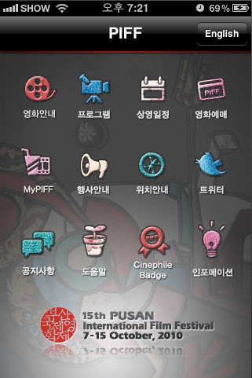 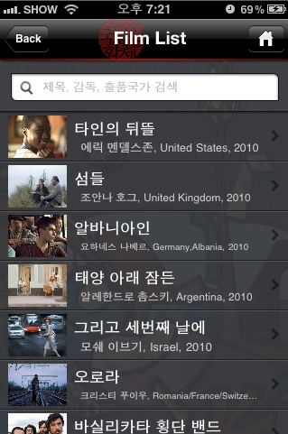 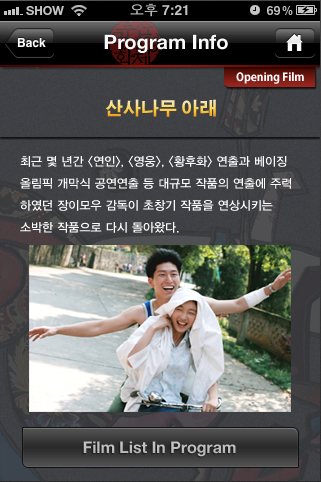

### 국악 방송

(공식) 실시간 국악 방송 어플리케이션 
실시간 방송 듣기, 편성표 기능 제공

- 소속 : NSoft Inc.
- 사용기술 : Objective-C 
- 프로젝트 인원 : 기획 1명, 개발 1명, 디자인 1명
- AppStore (http://itunes.apple.com/app/id393837434)

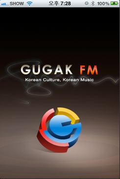 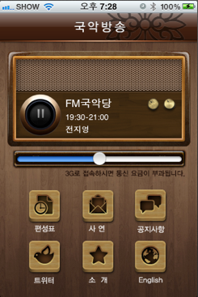 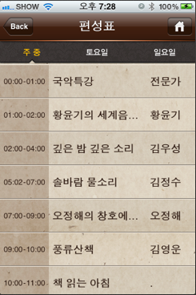

### LG Smart Laundry

LG 세탁기 진단 모드의 음성 인식을 통한 진단 어플리케이션
스마트 진단, 코스 다운로드, 원격 제어 기능 제공

- 소속 : NSoft Inc.
- 사용기술 : Objective-C
- 프로젝트 인원 : 개발 1명 (음성 인식 라이브러리 및 디자인 : LG 제공)
- AppStore (http://itunes.apple.com/app/id425153323)

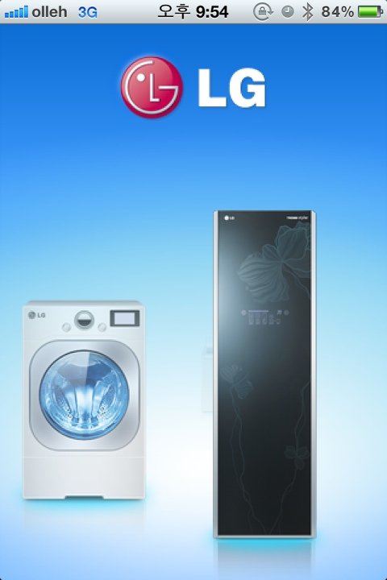 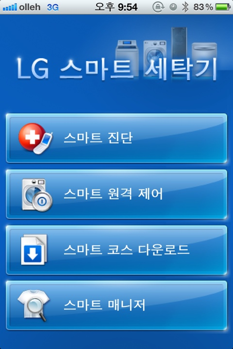 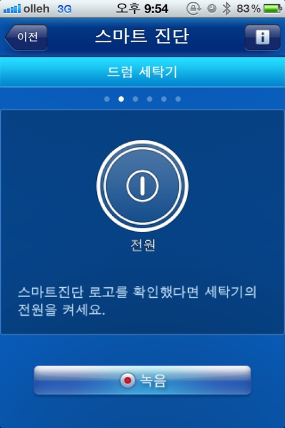 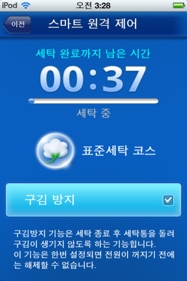

### Amore Recruit

아모레퍼시픽 공식 채용 어플리케이션
채용공채 날짜 제공 및 합격자 발표 기능 제공

- 소속 : (주) 위자드웍스
- 사용기술 : Objective-C
- 프로젝트 인원 : 기획 1명, 개발 1명, 디자인 1명
- AppStore (http://itunes.apple.com/app/id433372972)

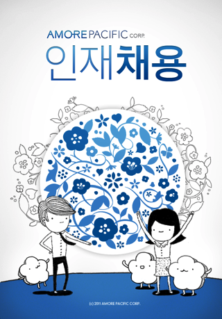 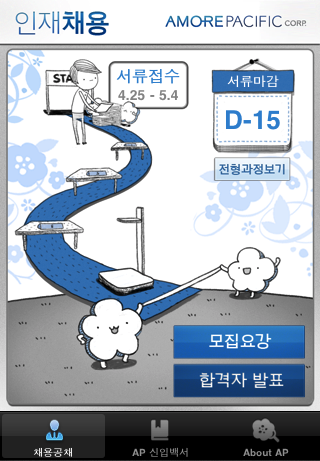

### Pink Ribbon

아모레퍼시픽 핑크 리본 공식 어플리케이션
API 를 이용한 키오스크와 사진 연동 기능 제공

- 소속 : (주) 위자드웍스
- 사용기술 : Objective-C
- 프로젝트 인원 : 기획 1명, 개발 1명, 디자인 1명
- AppStore (http://itunes.apple.com/app/id444664128)

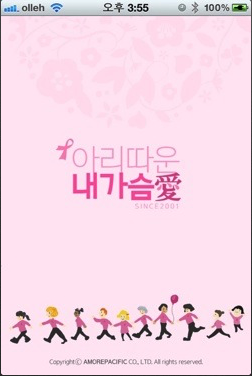 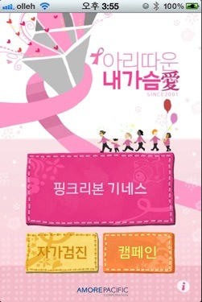 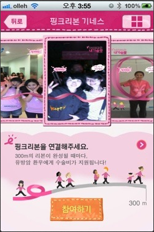

### UFO Clock

탁상 시계 어플리케이션

- 소속 : (주) 위자드웍스
- 사용기술 : Objective-C
- 프로젝트 인원 : 기획 1명, 개발 1명, 디자인 1명

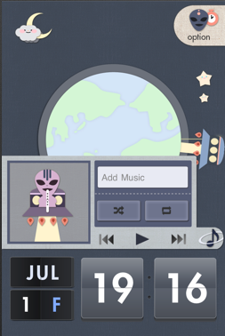 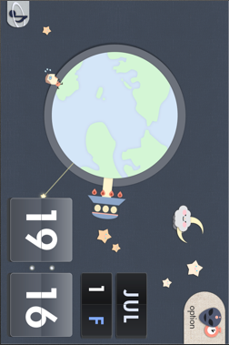 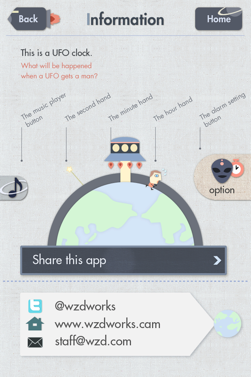

### 청년기술창업 E-Book (iPad)

중기청에서 제공하는 청년 기술 창업 메뉴얼을 E-Book 으로 제공
epub 을 사용한것이 아니라 네이티브 언어로 모든 페이지 개발

- 소속 : (주) 위자드웍스
- 사용기술 : Objective-C
- 프로젝트 인원 : 기획 1명, 개발 1명, 디자인 1명
- AppStore (https://itunes.apple.com/app/id510642441)

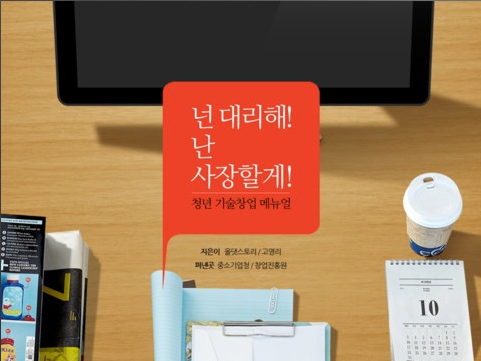 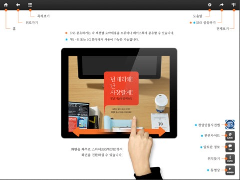 

### 솜클라우드 (솜노트, 솜투투)

서버 동기화를 이용한 노트 및 투두 어플리케이션 

- 소속 : (주) 위자드웍스
- 사용기술 : Objective-C, SQLite
- 프로젝트 인원 : 기획 1명, 개발 4명 (프론트 1명, 백엔드 1명, 안드로이드 1명, iOS 1명), 디자인 1명
- AppStore (http://itunes.apple.com/app/id515219433)

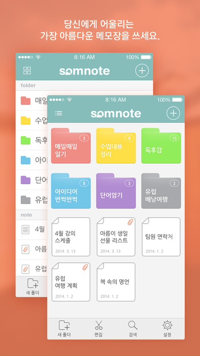 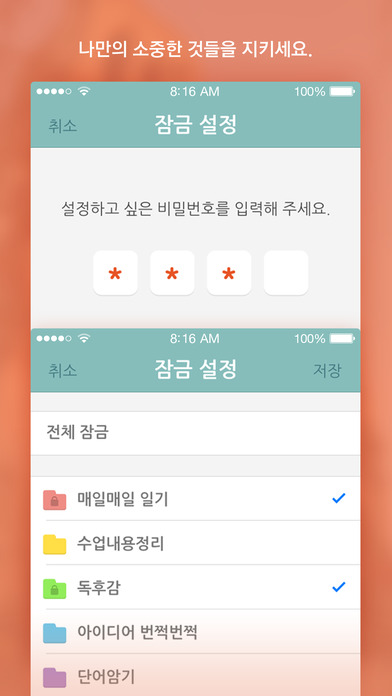 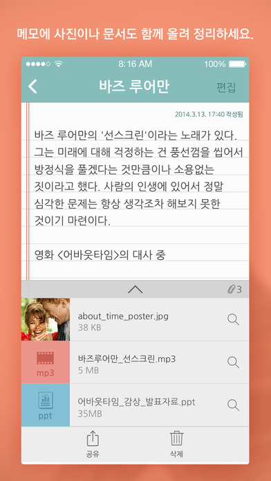

### ClienS

클리앙 비 공식 어플리케이션
클리앙 로그인, 검색, 게시판 리스트, 본문, 댓글 달기, 쪽지 보내기, 회원 메모 및 테마 기능 제공

- 소속 : 개인
- 사용기술 : Objective-C, 정규식 HTML 파싱
- AppStore (https://itunes.apple.com/app/id696533191)

 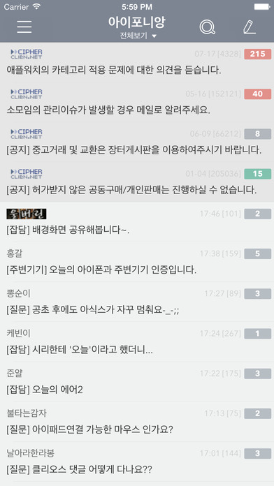 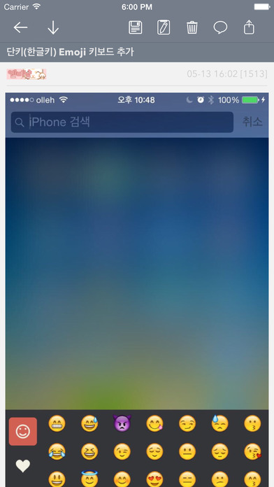

### 패밀리북

가족 그룹 SNS 서비스 
글쓰기, 사진 앨범, 1:1 메세징, 가족도 기능 제공

- 소속 : (주) 한시간컴
- 사용기술 : Objective-C, CoreData, APNS
- 프로젝트 인원 : 기획 1명, 개발 3명 (백엔드 1명, 안드로이드 1명, iOS 1명), 디자인 1명
- AppStore (http://itunes.apple.com/app/id588633215)

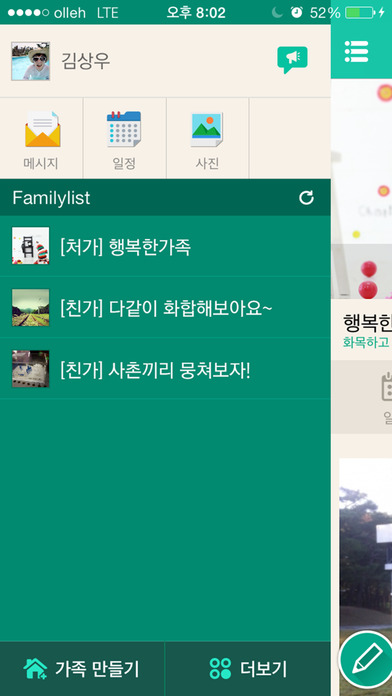 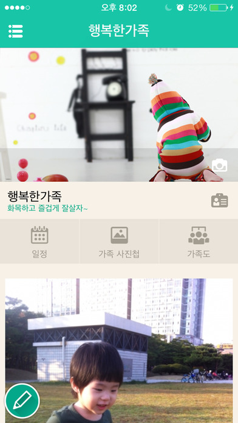 

### 노크노크

주소록 동기화를 이용한 모바일 쪽지 (약속 잡기) SNS 서비스

- 소속 : (주) 한시간컴
- 사용기술 : Objective-C, CoreData, APNS
- 프로젝트 인원 : 기획 1명, 개발 3명 (백엔드 1명, 안드로이드 1명, iOS 1명), 디자인 1명
- AppStore (https://itunes.apple.com/app/id922396277)

 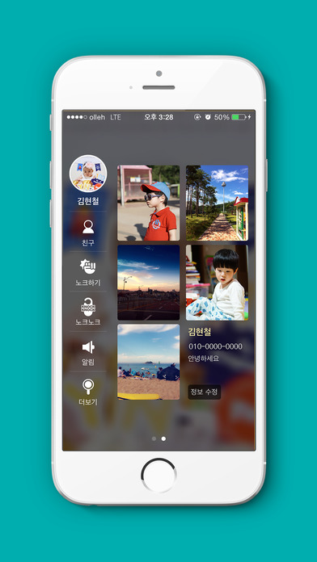 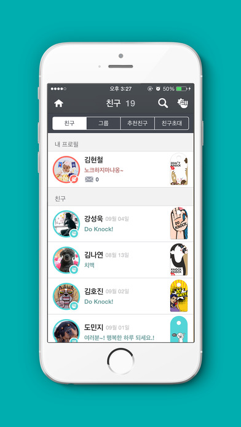

### 홈쇼핑 모아

홈&쇼핑, 현대홈쇼핑, 롯데홈쇼핑등 홈쇼핑 실시간 방송 스케쥴, 방송 보기 및 알림 기능 제공
애플워치 (WatchOS 1) 기능 제공 

- 소속 : (주) 버즈니
- 사용기술 : Objective-C, Swift 2, APNS
- 프로젝트 인원 : 기획 1명, 개발 4명 (프론트 1명, 백엔드 1명, 안드로이드 1명, iOS 1명), 디자인 1명
- AppStore (https://itunes.apple.com/app/id616581116)

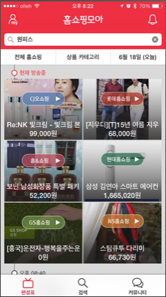 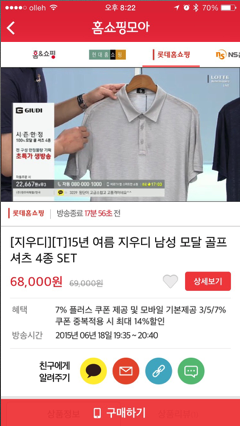   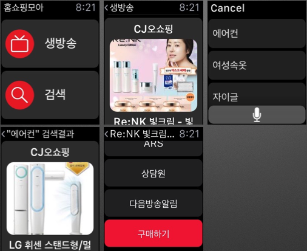

###  잡플래닛 채용

잡플레닛 채용 공고 페이지 개발

- 소속 : (주) 브레인커머스
- 사용기술 : Objective-C, Swift 2
- 프로젝트 인원 : iOS 4명
- AppStore (https://itunes.apple.com/app/id981750452)

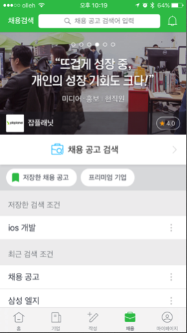 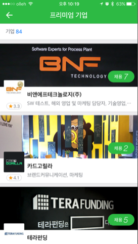 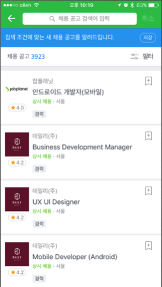

### 단키, 한글키 

단키 : 단모음, 무이단모음, 한글 쿼티 키보드 제공 
한글키 : 천지인, 나랏글, 천지인Plus 키보드 제공

커서 이동 기능, 테마 기능, 여러 옵션 기능 제공

- 소속 : 개인
- 사용기술 :  Objective-C, Swift 3
- AppStore 단키 (https://itunes.apple.com/app/id922851586), 한글키 (https://itunes.apple.com/app/id935555191)

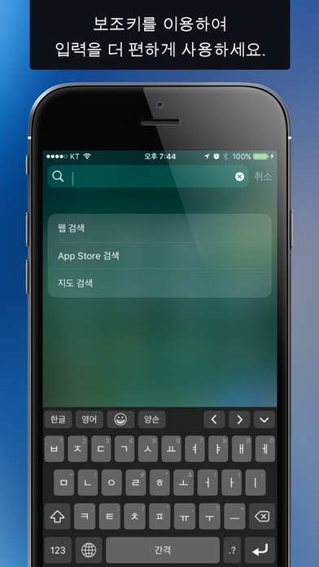 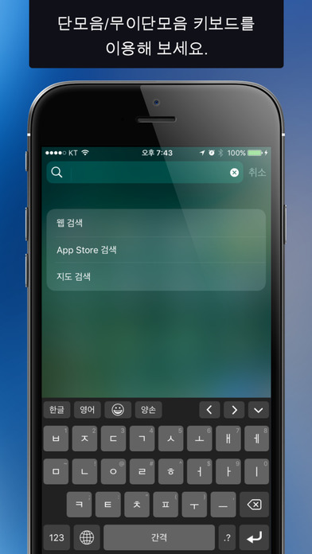 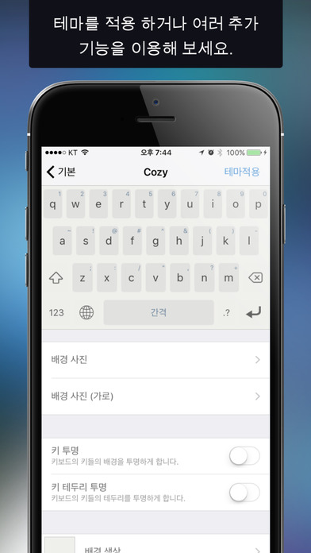 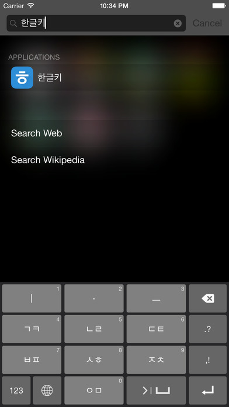

### 카카오톡 오픈채팅

카카오톡 오픈채팅 개발

- 소속 : (주) 카카오
- 사용기술 : Objective-C

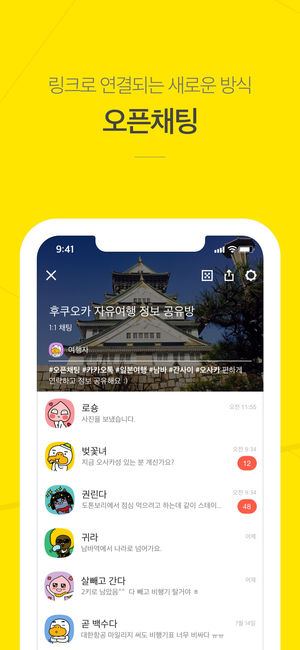 
